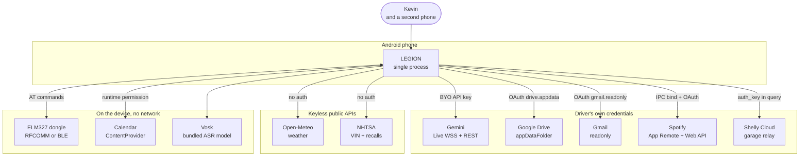

# C1: System context

One Android phone app. Everything it talks to, it talks to **directly, on the driver's own
credentials**. There is no LEGION server, no proxy, no broker, no hosted key. That is the shape the
whole system is bent around, and it is a locked decision, not a cost optimisation.

## What each boundary costs

| System | How it authenticates | Offline behaviour |
|---|---|---|
| **Gemini Live** (`service/GeminiLiveSession.kt`) | BYO key only. `service/LiveConnection.kt` resolves direct-or-nothing; no broker path exists | Hard fail, pre-flight checked. Says "NO SIGNAL OUT HERE" rather than hanging |
| **Gemini REST** (`ai/SubAgent.kt`) | Same key, `?key=` | Returns a typed result so callers distinguish offline from rate-limit from bad-key |
| **Drive appDataFolder** (`sync/DriveClient.kt`) | `drive.appdata` scope via `sync/DriveAuth.kt` | Opportunistic. A failed pass is just a failed pass |
| **Gmail** (`gmail/GmailClient.kt`) | `gmail.readonly` via `gmail/GmailAuth.kt` | Degrades with distinct spoken causes per failure kind |
| **Spotify** (`media/SpotifyController.kt`) | Driver's own client ID, redirect `com.kevin.legion://spotify-callback` | Needs the Spotify app installed and logged in with Premium. App Remote creates the active device, so playback works with Spotify closed - see [[c3-music]] |
| **Shelly Cloud** (`vehicle/ShellyCloudOpener.kt`) | `auth_key` query parameter | **No offline path.** See the caveat below |
| **Open-Meteo** (`weather/WeatherController.kt`) | None | Serves the last cached reading rather than failing |
| **NHTSA** (`vehicle/VinDecoder.kt`) | None | Feature simply unavailable |
| **OBD dongle** (`vehicle/ObdTransport.kt`, `vehicle/BleTransport.kt`) | Bluetooth pairing | Local radio. No dongle means the telemetry tools refuse rather than guess |
| **Calendar** (`data/local/Event.kt`, `engine/dates/DatesAgenda.kt`) | None | Local `events` table only - one-today ticket 01 (2026-09-01) cut the live `CalendarContract` read/write entirely ("cut Google entirely"). Fully offline by construction, not merely in practice |

## Three things that are easy to get wrong

**Calendar is not a REST integration.** It reads `CalendarContract` through the ContentResolver and
expands recurrence via `Instances`. If you find yourself drawing an HTTPS arrow to a Google Calendar
API, or reaching for an OAuth scope, stop. There is no scope and no network call.

**The ledger no longer ingests anything on the phone.** Backend-erp ticket 25 ("statement ingestion
leaves the phone entirely") killed the SAF-folder-scan path this paragraph used to describe
(the old folder scanner, the statement parsers, and `LedgerFolderPreferences`) - bank statements are
ingested by the web app now, against `public.commit_statement`. The phone only ever reads
`ledger_transactions`. This is unrelated to the `appDataFolder` REST sync in `sync/`, which carries
the app's own state - two different things that used to wear the same word ("Drive"), and now only
one of them exists on the phone at all.

**The garage opener depends on a third-party cloud.** `vehicle/ShellyCloudOpener.kt` posts to Shelly's
servers. That does not violate "no Kevin-hosted anything" (nobody here runs it) but it *is* the one
feature with a hard cloud dependency and no local fallback. A local BLE implementation exists at
`vehicle/ShellyBleOpener.kt`, fully written, and **is never instantiated** - it sits behind a seam
waiting for someone to wire it up.

## What deliberately does not exist

Absences worth knowing, because each was a choice and each gets proposed again otherwise:

- **No backend of any kind.** No Firestore, no broker, no proxy, no hosted key. This is what makes
  clone-and-run possible. See [[0002-no-hosted-backend]].
- **No WorkManager, JobScheduler, or CoroutineWorker.** `androidx.work` is not a dependency.
  `AlarmManager` via `notes/AlarmScheduler.kt` is the only OS scheduler.
- **No embedding API call.** `data/local/CompanionMemory.kt` has `embeddingVector` and
  `embeddingModel` columns and nothing populates them. Memory recall in `ai/AriaBrain.kt` is lexical,
  written so one term can be swapped for cosine similarity later.
- **No FusedLocationProvider**, despite `play-services-auth` being present.
  `location/LocationController.kt` uses raw `LocationManager` GPS and NETWORK providers.
- **No comparative or anonymised fleet data**, ever. There is nowhere for it to go by construction.

## Related

[[c2-containers]] for what runs inside the process. [[adr-index]] for why the boundaries are where
they are.
