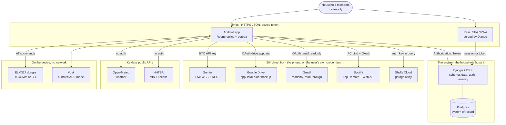

# C1: System context

**LEGION is one Django server over one Postgres, and everything else is a limb that talks to it over
HTTPS JSON.** The server owns the schema, runs the CLAUDE.md §4 gate, holds auth and scopes every row
to a household. The Android app is a device limb; a React web app served from the same server is the
second limb. [[0044-django-is-the-engine]] is the binding ruling and [[0045-households-are-tenants]]
is what "whose row is this" means.

> **This page said the opposite until 2026-09-16.** It claimed "there is no LEGION server, no proxy,
> no broker, no hosted key" and listed "no backend of any kind" as a deliberate absence. Two ADRs had
> already killed that topology. The part that survived the rewrite is the *reason* the old sentence
> existed: **nothing Kevin-hosted for strangers.** The household hosts its own engine. That is a
> different claim from "there is no server", and conflating the two is what let this page rot.

## The engine

| Piece | Where | What it is |
|---|---|---|
| Project config | `server/legion/settings.py`, `server/legion/urls.py` | The Django project. Everything else is an app under it |
| Sync API | `server/api/synced.py`, `server/api/registry.py` | `SyncedModelViewSet`, the generic per-table read/write surface the phone syncs against |
| Events | `server/api/events.py` | Hand-written ahead of the generic viewset, and still its own code path |
| Checklists | `server/checklists/models.py` | The first tables Django owns end to end, with no legacy shape to honour |
| Identity and tenancy | `server/household/models.py`, `server/household/authentication.py`, `server/household/tenancy.py` | `Household`, `User`, `DeviceToken`, `Invite`; the token auth class; `TENANT_TABLES` |
| The §4 gate | `server/ingest/gate.py`, `server/ingest/views.py` | The reconciliation arithmetic in pure Python, behind `POST /api/ingest/statement` and `/api/ingest/receipt` |
| Legacy mirrors | `server/legacy/models/` | `managed = False` models over the pre-existing `public` schema. Django does not migrate these |
| Web client | `server/frontend/`, `server/web/views.py` | React 19, Vite, TanStack Router and Query, built into the image and served at the site root by a catch-all view |

**Authentication is a device token per limb**, `Authorization: Token <key>`, hashed at rest and
revocable alone, so a lost phone is revoked without touching anyone else. Browser sessions are the
second accepted scheme, for the web client which has no such header.

**Tenancy is by household and nothing finer.** Every scoped read and write narrows on the request's
household in `SyncedModelViewSet`. Note what that is and is not: it is **one Python code path**, not
a database guarantee. [[0045-households-are-tenants]] describes Postgres row-level security keyed on
a per-request session variable as the backstop under it; **that is not in the code**. A grep of
`server/` for `ENABLE ROW LEVEL SECURITY`, `CREATE POLICY` or `set_config` returns nothing outside
Django's own vendored library. Treat the filter as the only thing standing between two households,
and the ADR's second layer as designed rather than built.

**It runs from one image.** `server/Dockerfile` builds the Vite bundle in a Node stage and the Django
app in a Python stage; `server/entrypoint.sh` migrates and then execs gunicorn on `${PORT:-8000}`.
The same image serves the household's own `deploy/docker-compose.yml` stack and a managed deployment.
Both an arm64 VM target and a Cloud Run target are wired, with Cloud Run named in the build comments
as the rollback of the two.

## What each boundary costs

| System | How it authenticates | Offline behaviour |
|---|---|---|
| **The engine** (`backend/engine/EngineConfig.kt`) | Device token minted at `POST /api/auth/login`, stored encrypted | **Reads keep working** from the Room replica. Writes queue in the outbox and the app says so in words |
| **Gemini Live** (`service/GeminiLiveSession.kt`) | BYO key only. `service/LiveConnection.kt` resolves direct-or-nothing; no broker path exists | Hard fail, pre-flight checked. Says "NO SIGNAL OUT HERE" rather than hanging |
| **Gemini REST** (`ai/SubAgent.kt`) | Same key, `?key=` | Returns a typed result so callers distinguish offline from rate-limit from bad-key |
| **Drive appDataFolder** (`sync/DriveClient.kt`) | `drive.appdata` scope via `sync/DriveAuth.kt` | Opportunistic. A failed pass is just a failed pass |
| **Gmail** (`gmail/GmailClient.kt`) | `gmail.readonly` via `gmail/GmailAuth.kt` | Degrades with distinct spoken causes per failure kind |
| **Spotify** (`media/SpotifyController.kt`) | User's own client ID, redirect `com.kevin.legion://spotify-callback` | Needs the Spotify app installed and logged in with Premium. App Remote creates the active device, so playback works with Spotify closed - see [[c3-music]] |
| **Shelly Cloud** (`vehicle/ShellyCloudOpener.kt`) | `auth_key` query parameter | **No offline path.** See the caveat below |
| **Open-Meteo** (`weather/WeatherController.kt`) | None | Serves the last cached reading rather than failing |
| **NHTSA** (`vehicle/VinDecoder.kt`) | None | Feature simply unavailable |
| **OBD dongle** (`vehicle/ObdTransport.kt`, `vehicle/BleTransport.kt`) | Bluetooth pairing | Local radio. No dongle means the telemetry tools refuse rather than guess |

## Three things that are easy to get wrong

**The phone has two backends, not one, and the switch is per aspect.**
`backend/engine/EngineTransport.kt` answers `SUPABASE` or `DJANGO` for each aspect name, and
`backend/engine/EngineBackends.kt` turns that answer into an object. All nine aspects now default to
Django **when the device has an engine address and a token**; with neither, every aspect falls back
to Supabase exactly as before. So "which server does this write go to" has no single answer at rest
- read the transport. [[c2-containers]] carries the detail.

**Calendar is not a REST integration, and is no longer a ContentProvider read either.** One-today
ticket 01 cut the live `CalendarContract` read and write entirely. Events are rows
(`data/local/Event.kt`, `engine/dates/DatesAgenda.kt`) that sync through the engine like any other
aspect. There is no Google Calendar scope and no network call to Google for it.

**The garage opener depends on a third-party cloud.** `vehicle/ShellyCloudOpener.kt` posts to Shelly's
servers. That does not violate the hosting rule (nobody here runs it) but it *is* the one feature with
a hard cloud dependency and no local fallback. A local BLE implementation exists at
`vehicle/ShellyBleOpener.kt`, fully written, and **is never instantiated** - it sits behind a seam
waiting for someone to wire it up.

## What deliberately does not exist

Absences worth knowing, because each was a choice and each gets proposed again otherwise:

- **Nothing Kevin-hosted for strangers.** No Firestore, no broker, no proxy, no hosted key. A
  stranger clones, brings up their own stack and points their own build at it. That is
  [[0003-clone-and-run]], and the engine did not weaken it: the engine is a thing the household runs,
  not a thing Kevin runs for them. One engine holding Kevin's parents is the household widened, not a
  customer ([[0045-households-are-tenants]]).
- **No Postgres row-level security**, despite [[0045-households-are-tenants]] describing it. Said
  again here because an absence that an ADR implies is present is the dangerous kind.
- **No scheduled job.** The worker container and its cron runner are built and its crontab is empty.
  Nothing runs on a timer today.
- **No object storage.** `MEDIA_ROOT` is a filesystem path with the default Django storage backend.
  `server/legion/settings.py` names this as an open gap, not a design.
- **No WorkManager, JobScheduler, or CoroutineWorker.** `androidx.work` is not a dependency.
  `AlarmManager` via `notes/AlarmScheduler.kt` is the only OS scheduler on the phone.
- **No embedding API call.** `data/local/CompanionMemory.kt` has `embeddingVector` and
  `embeddingModel` columns and nothing populates them. Memory recall in `ai/AriaBrain.kt` is lexical,
  written so one term can be swapped for cosine similarity later.
- **No FusedLocationProvider**, despite `play-services-auth` being present.
  `location/LocationController.kt` uses raw `LocationManager` GPS and NETWORK providers.
- **No comparative or anonymised fleet data**, ever.

## Related

[[c2-containers]] for what runs inside the phone process and how a write reaches the engine.
[[adr-index]] for why the boundaries are where they are.
