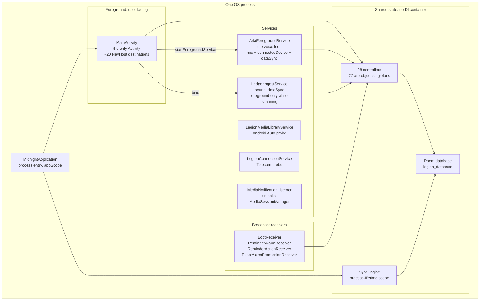

# C2: Containers

**Everything runs in one OS process.** No component declares `android:process`, so there is no IPC
inside the app and no cross-process state to reconcile. "Container" here means a long-lived Android
component with its own lifecycle, not a separate process.

## The containers

| Container | Entry point | Why it exists separately |
|---|---|---|
| `MidnightApplication` | `MidnightApplication.kt` | Process entry. Owns `appScope`, a `SupervisorJob` on IO that lives as long as the process. Runs the one-time `data/MidnightImport.kt` |
| `MainActivity` | `ui/MainActivity.kt` | The **only** Activity. One `NavHost`, routes as string constants in `ui/LegionRoute.kt`. Also hosts the Spotify OAuth token exchange, deliberately above the NavHost so a recomposition cannot lose it |
| `AriaForegroundService` | `service/AriaForegroundService.kt` | The voice loop. Owns `LiveSessionController`, starts Vosk, runs the health, arrival, drive and recap monitors. Also holds the Spotify App Remote connection for its whole life, deliberately - see [[0032-spotify-app-remote-spine]] |
| `LedgerIngestService` | `service/LedgerIngestService.kt` | **Separate on purpose.** Folding it into `AriaForegroundService` would boot the entire voice assistant every time the Ledger tab opens. Goes foreground only inside `startScan`, not in `onCreate` |
| `LegionMediaLibraryService` | `car/LegionMediaLibraryService.kt` | Exported media3 stub. Android Auto binds it cross-process. Probe stage |
| `LegionConnectionService` | `car/LegionConnectionService.kt` | Exported Telecom self-managed ConnectionService. Probe stage |
| `MediaNotificationListener` | `service/MediaNotificationListener.kt` | Exists purely so the OS will hand over `MediaSessionManager`. Parses no notifications |

## Coroutine scopes, and which ones never die

This matters more than usual here, because there is no DI container and no ViewModel layer to bound
anything.

**Process-lifetime, never cancelled (five):**

- `MidnightApplication.kt` `appScope` - deliberately has no `CoroutineExceptionHandler`
- `sync/SyncEngine.kt` `engineScope` - its own doc says nothing cancels it
- `media/NowPlayingController.kt` `ioScope`
- `service/WakeWordEngine.kt` - on `Dispatchers.Default`, cancelled on `stop()` (`AmbientListener` sat beside it until it was retired 2026-08-21)

**Session-scoped:** `service/GeminiLiveSession.kt` holds an IO scope and a `Main.immediate` scope.
`service/LiveSessionController.kt` runs on `Main.immediate`, which is why its `activeToolCalls`
counter can be a plain `Int` without a race.

**Real threads:** the mic loop (`AudioRecord`) and the playback path (`AudioTrack`) in
`service/GeminiLiveSession.kt`. The playback path carries an explicit lock added after a crash in
August 2026.

Each broadcast receiver spins its own IO scope inside `onReceive`. `ReminderAlarmReceiver` runs
whether or not the foreground service is alive, which is the point of it being a receiver.

## The controller layer

28 controllers. **27 are Kotlin `object` singletons** - process-global, no DI, no ViewModel between
them and Compose. The single exception is `LiveSessionController`, which is a `class`, instantiated
exactly once, by `AriaForegroundService`.

That is unusual enough to state plainly: **state lives in top-level singletons and Room, and the UI
reads them directly.** If you are looking for the layer that mediates, there isn't one.

Full roster grouped by aspect: [[c3-data]].

## Related

[[c1-context]] for the outside boundaries. [[c3-voice-loop]] for what happens inside
`AriaForegroundService`. [[c3-ingestion]] for what happens inside `LedgerIngestService`.
