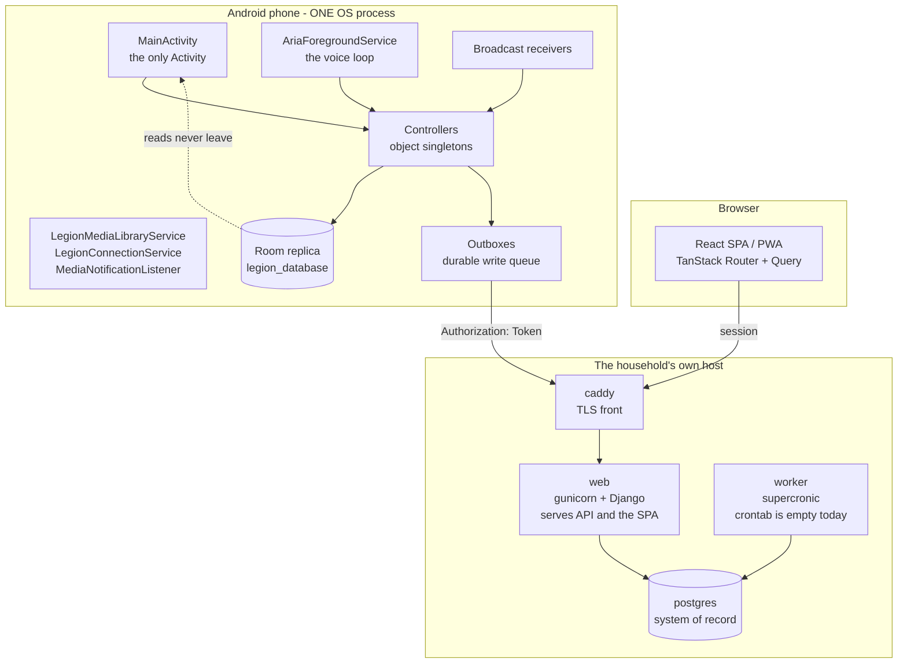

# C2: Containers

A container here is a separately deployable or separately lifecycled runtime. Since
[[0044-django-is-the-engine]] there are containers on **both sides** of the HTTPS boundary, and this
page used to describe only the phone's.



## Server-side containers

From `deploy/docker-compose.yml`, all built from the one `server/Dockerfile`:

| Container | What it runs | Note |
|---|---|---|
| `web` | `server/entrypoint.sh` migrates, then gunicorn on `${PORT:-8000}` | Serves the JSON API **and** the built SPA at the site root |
| `worker` | supercronic over a crontab | **The crontab is empty.** Nothing is scheduled today |
| `postgres` | The system of record | Only Django writes it |
| `caddy` | TLS termination, per `deploy/Caddyfile` | |

The SPA is not a separate deployment. It is built into the image in a Node stage and served by a
catch-all Django view (`server/web/views.py`), which is why the browser limb has no container of its
own here.

## The phone: still exactly one OS process

**No component declares `android:process`**, so there is no IPC inside the app and no cross-process
state to reconcile. "Container" on this side means a long-lived Android component with its own
lifecycle.

| Container | Entry point | Why it exists separately |
|---|---|---|
| `MidnightApplication` | `MidnightApplication.kt` | Process entry. Owns `appScope`, a `SupervisorJob` on IO that lives as long as the process. Runs the one-time `data/MidnightImport.kt` |
| `MainActivity` | `ui/MainActivity.kt` | The **only** Activity. One `NavHost`, routes as string constants in `ui/LegionRoute.kt`. Also hosts the Spotify OAuth token exchange, deliberately above the NavHost so a recomposition cannot lose it |
| `AriaForegroundService` | `service/AriaForegroundService.kt` | The voice loop. Owns `LiveSessionController`, starts Vosk, runs the health, arrival, drive and recap monitors. Also holds the Spotify App Remote connection for its whole life, deliberately - see [[0032-spotify-app-remote-spine]] |
| `LegionMediaLibraryService` | `car/LegionMediaLibraryService.kt` | Exported media3 stub. Android Auto binds it cross-process. Probe stage |
| `LegionConnectionService` | `car/LegionConnectionService.kt` | Exported Telecom self-managed ConnectionService. Probe stage |
| `MediaNotificationListener` | `service/MediaNotificationListener.kt` | Exists purely so the OS will hand over `MediaSessionManager`. Parses no notifications |

## How a write reaches the engine

This is the part [[0044-django-is-the-engine]] rule 4 turns into a hard requirement, and it is built:
**the phone depends on the server to write, and never to read.**

1. A controller writes the local Room row first, so the UI updates at local-write speed.
2. The same call enqueues the server write. Per-aspect queues live in `backend/` (`EventsOutbox.kt`,
   `ChecklistsOutbox.kt`, `BodyOutbox.kt`, `MemoryOutbox.kt`, `LedgerConfigOutbox.kt`,
   `LastAspectsOutbox.kt`); the generic durable table behind that shape is
   `data/local/SyncOutbox.kt`, whose `sync_outbox` rows carry the target table, the operation, the
   local id and an opaque JSON payload.
3. A drain sends them. It is **at-least-once and bounded**: `attempts` and `lastError` are columns, a
   row that hits the cap is left in the table and excluded from the next drain rather than deleted or
   retried forever. There is no other durable record of a write that never landed, which is why it is
   never deleted.
4. Reads come from Room. With the engine unreachable the app still reads everything and says in words
   that it is behind.

**Realtime is a poll, not a socket** on the Django path: foreground, after every write, and on an
interval (`backend/engine/EnginePoll.kt`).

## Two backends at once, per aspect

`backend/engine/EngineTransport.kt` stores one transport per aspect name and answers `SUPABASE` or
`DJANGO`; `backend/engine/EngineBackends.kt` is the single place that answer becomes an object. All
nine aspects sit in `DJANGO_BY_DEFAULT`, but the default is **conditional on the device having an
engine address and a token** - without both, every aspect resolves to Supabase.

So the Supabase implementations are still compiled in and still reachable, and `supabase-kt` is still
declared in `app/build.gradle.kts`. [[0044-django-is-the-engine]] says Supabase retires and it has
not finished retiring. Do not write "Supabase is gone" into a doc or a comment while
`SupabaseEventsBackend` and its siblings still exist
(`ls app/src/main/java/com/kevin/legion/backend/Supabase*Backend.kt`).

## Coroutine scopes, and which ones never die

This matters more than usual here, because there is still no DI container and no ViewModel layer to
bound anything.

**Process-lifetime, never cancelled:**

- `MidnightApplication.kt` `appScope` - deliberately has no `CoroutineExceptionHandler`
- `sync/SyncEngine.kt` `engineScope` - its own doc says nothing cancels it
- `media/NowPlayingController.kt` `ioScope`
- `service/WakeWordEngine.kt` - on `Dispatchers.Default`, cancelled on `stop()`

**Session-scoped:** `service/GeminiLiveSession.kt` holds an IO scope and a `Main.immediate` scope.
`service/LiveSessionController.kt` runs on `Main.immediate`, which is why its `activeToolCalls`
counter can be a plain `Int` without a race.

**Real threads:** the mic loop (`AudioRecord`) and the playback path (`AudioTrack`) in
`service/GeminiLiveSession.kt`. The playback path carries an explicit lock added after a crash in
August 2026.

Each broadcast receiver spins its own IO scope inside `onReceive`. `ReminderAlarmReceiver` runs
whether or not the foreground service is alive, which is the point of it being a receiver.

## The controller layer

**Almost every controller is a Kotlin `object` singleton** - process-global, no DI, no ViewModel
between it and Compose. `LiveSessionController` is the long-standing exception, a `class`
instantiated exactly once by `AriaForegroundService`.

Counts belong where they are computed, not in this sentence:

```
grep -rc "^object [A-Za-z]*Controller" app/src/main/java/
```

That is unusual enough to state plainly: **state lives in top-level singletons and Room, and the UI
reads them directly.** If you are looking for the layer that mediates, there isn't one.

**CLAUDE.md §8 rules that this changes** - Hilt on KSP, constructor injection, a ViewModel per
screen. Step 1 of its migration order is done: Room's annotation processor is KSP and the kapt plugin
is gone from `app/build.gradle.kts`. Steps 2 onward are not: there is no `@HiltAndroidApp`, no
`@Inject`, and no `ViewModel` subclass in `app/`. Read the rule as the direction, and this page as
the state.

## Related

[[c1-context]] for the outside boundaries and the engine's own map. [[c3-data]] for the schema and
the two storage shapes. [[c3-voice-loop]] for what happens inside `AriaForegroundService`.
[[c3-ingestion]] for what is left of on-phone ingestion.
