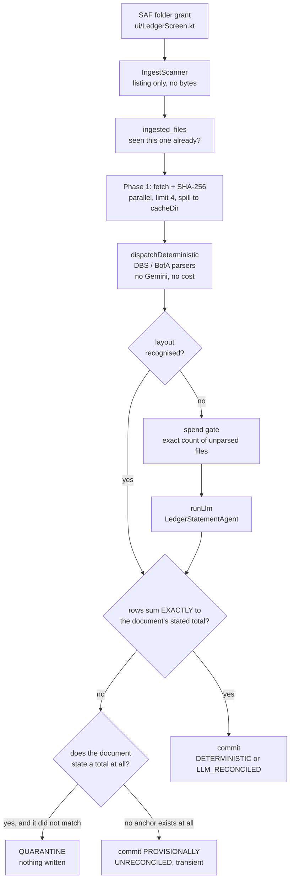

# C3: Ingestion and the gate

Two aspects ingest documents: **ledger** reads bank statements, **pantry** reads photographed
grocery receipts. They share one rule and almost no code, because their inputs are nothing alike.

The rule is [[0006-reconciliation-gate]]. Everything below is that rule made concrete.

## The gate, stated exactly

1. **Deterministic first** where a deterministic path exists. `ledger/parsers/DbsStatementParser.kt`
   and `ledger/parsers/BofaStatementParser.kt` are primary. The LLM runs only when no parser
   recognises the layout.
2. **Rows must reconcile against the document's own stated total, exactly.** Not within a tolerance.
   Sum equals printed total, or the whole document quarantines. Nothing partial is ever written.
3. **Money is `Long` cents.** [[0007-money-as-long-cents]]. The equality in rule 2 is why.
4. **Every row is tagged** `DETERMINISTIC` or `LLM_RECONCILED`.
5. **Anything the document does not state is an estimate**, excluded from the check and labelled.
   [[0008-estimates-are-not-facts]].
6. **A check that passes when nothing parsed is not a gate.** Inside a recognised section, every
   line that is not the section's own total must parse, or the document quarantines.
7. **A source with no anchor may be stored provisionally, never as fact.**
   [[0009-provisional-unreconciled-tier]].

Rules 6 and 7 are the two that were learned the hard way. Rule 6 exists because BofA's card
statement prints interest rows in a different shape, all four silently failed to match, and the
section check reconciled zero parsed rows against a printed $0.00 and passed. It held only because
interest happened to be zero that month.

**Since [[cutover3-2026-08-24]] (2026-08-24), the gate's own logic above is unchanged, but where its
result LANDS is not: `ledger/IngestPipeline.kt`'s `commit` writes through `engine/RecordStore.kt`
(one `Transaction` record per row, `RecordStore.create`) instead of `LedgerTransactionDao.insertAll`,
and rule 7's supersession (trashing a superseded `UNRECONCILED` row) now happens inside that same
`db.withTransaction` rather than as a separate legacy-table delete - so a commit and its
supersession are atomic together, where before they were two independent writes. `LedgerController`
is now a read/write bridge over the engine rather than the owner of its own table.**

## Money as engine payload, not a schema column

The reconciliation gate's money-as-`Long`-cents rule ([[0007-money-as-long-cents]]) survives the
cutover unchanged, but its home moved: cents live inside `EngineRecord.payload` (JSON), typed by
the `Transaction` record type's field defs, not as a dedicated `INTEGER` column the way
`LedgerTransaction.amountCents` was. `PayloadCodec` is what serialises and deserialises it; nothing
about the gate's exactness requirement changed, only where the verified number is stored.

## Ledger

| Piece | Does |
|---|---|
| `service/IngestScanner.kt` | Walks the SAF tree with raw `queryChildDocuments`. Listing only on app open: no bytes, no parsing, no spend |
| `ledger/IngestPipeline.kt` | The two-phase run. [[0014-batch-ingestion-two-phase]] |
| `ledger/parsers/StatementDispatcher.kt` | Split into `dispatchDeterministic` and `runLlm`, with the spend gate between them. [[0016-llm-spend-gate-after-deterministic]] |
| `ledger/parsers/` | Five parsers: DBS, BofA statement, BofA card, and two CSV variants |
| `ledger/LedgerStatementAgent.kt` | The LLM fallback, on the driver's own key |
| `ledger/LedgerDedup.kt` | Counts matching rows per tuple, never tests existence. [[0015-dedup-counts-per-tuple]] |
| `data/local/IngestedFile.kt` | The per-file record. Work avoidance, not correctness. [[0013-ingested-file-ledger]] |

The batch is deliberately **not atomic**. 39 good statements commit even if the 40th quarantines.

## Pantry

Pantry has **no deterministic path at all**. Receipts are photographed, not born-digital, so there
is no layout to recognise. `pantry/PantryReceiptAgent.kt` runs LLM vision as the primary and only
extractor, via `ai/SubAgent.kt`'s inline image part.

That is a necessity, not a preference, and the gate still applies unchanged: line items must sum to
the receipt's printed total or the receipt quarantines.

The macros are the interesting part. Calories, protein, carbs and fat are model guesses from a
product name. **A receipt has never printed any of them**, so they cannot be gated even in
principle. They are excluded from the check, labelled estimates in the tool description and in every
string, and since 2026-08-02 they are physically segregated into a block headed `ESTIMATED, NOT ON
THE RECEIPT`.

## Adding a new ingestion path

The feature checklist in CLAUDE.md §7 is binding. In short: wire the gate, quarantine on mismatch,
tag provenance, use `Long` cents, label anything the source did not state, and make sure your check
cannot pass on an empty extraction.

If your source states no anchor at all, you are in [[0009-provisional-unreconciled-tier]] territory
and all four of its conditions apply together.

## Related

[[c2-containers]] for `LedgerIngestService` and why it is separate. [[adr-index]] for the full
decision set.
