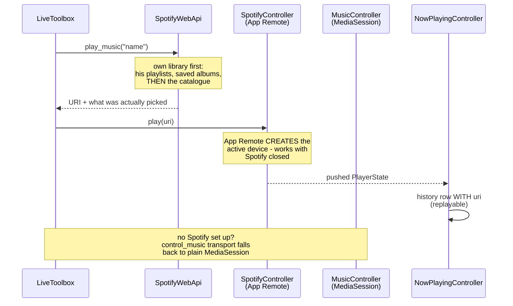

# C3: The music path

How a spoken music request becomes sound. Built across `.scratch/spotify-voice/` (ten tickets,
2026-08-19); everything here is `built`+`tested`, **nothing is `on-device` yet** - the stale
Spotify grant must be re-approved in Setup before any of it can run.

## Division of labour

| Piece | Role |
|---|---|
| `media/SpotifyWebApi.kt` | Resolves names into URIs. Search order is the driver's OWN library (playlists, saved albums) before the public catalogue - "play my gym mix" must never land on a stranger's playlist. Also the library writes: like, follow, add-to-playlist |
| `media/SpotifyController.kt` | App Remote. The only thing that makes sound come out, and the only route that creates an active device. Connection held in `AriaForegroundService`, see [[0032-spotify-app-remote-spine]] |
| `media/MusicController.kt` | Generic MediaSession transport. The zero-setup fallback: pause/skip works on whatever is playing, Spotify or not, once notification access is granted |
| `media/NowPlayingController.kt` | Observes playback, writes `MusicPlayHistoryEntry`. Since ticket 09 the row carries the Spotify URI when App Remote agrees, so `legion_history` can replay what it saw, not just name it |
| `media/VolumeController.kt` | Stream volume, no Spotify involvement |

## The tool surface

Five voice tools: `play_music` (by name, says what it actually picked), `control_music` (20
actions: transport, queue, like/unlike, follow/unfollow artist, shuffle/repeat, seek/restart,
add-to-playlist, more-from-this-artist), `get_music_queue`, `browse_my_music`, `control_volume`.
None sit behind a dispatcher - a driver mid-song does not want a sub-agent round-trip.

Every tool obeys the outcome-verb rule ([[0031-speech-honesty-clause]]): a play that did not
happen is reported as not having happened.

## The structural fact that shapes everything

**LEGION holds no Spotify playback scopes.** The Web API cannot start, stop, or transfer playback
anywhere. Everything audible goes through App Remote's app-to-app binding on THIS phone: no seeing
what plays on another device, no transferring playback to the car. That is a designed boundary,
not a gap - see the spotify-voice map's traced table.

## What is deliberately absent

- **Podcasts and audiobooks.** Out by decision, which also avoids the unverified question of
  whether App Remote plays episode URIs at all.
- **Creating playlists by voice.** Adding to one is in; creating one at speed is a thing done twice.
- **Spotify's discovery endpoints.** Dead for post-2024 client IDs; see
  [[0034-own-recommendation-engine]].
- **MusicRouter / MusicSource / mixtapes.** Retired in the 2026-07-31 pivot; callers check
  `SpotifyController.isConnected` directly.

## Two numbers nobody has measured

The playlist fuzzy-match threshold (0.6) and its cache TTL (15 min) were tuned against unit tests,
never against a spoken transcript. Treat both as provisional.

## Related

[[c2-containers]] for the service that holds the App Remote connection. [[c3-voice-loop]] for how
the tool call arrives. [[0033-byo-spotify-client-id]] for why setup requires the driver's own
Spotify dev app.
