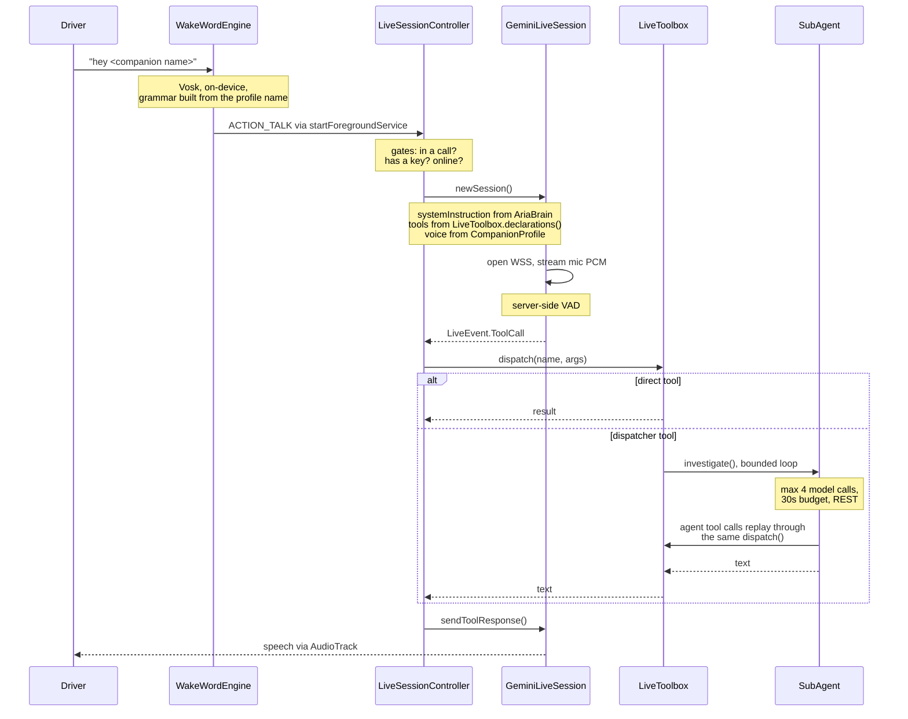

# C3: The voice loop

One utterance, end to end. This is the most tangled path in the app and the one most worth having a
picture of.

## Where each named piece actually sits

The names are not self-explanatory and several are not where you would guess.

| Piece | Role | Not in the turn loop? |
|---|---|---|
| `service/WakeWordEngine.kt` | Vosk, on-device, opt-in. Grammar is `"hey <name>"` built from the active companion profile | Entry only |
| `service/LiveSessionController.kt` | **The conversation state machine and sole socket owner.** Three doors in: prewarm, start conversation, start proactive, all funnelled through one `newSession()` | Core |
| `service/GeminiLiveSession.kt` | The WebSocket, the mic loop, the playback path. Emits `LiveEvent`s | Core |
| `service/LiveToolbox.kt` | Every tool declaration and the single `dispatch()` entry | Core |
| `service/EngineToolbox.kt` | The nine aspect-engine meta-tools (generic record CRUD over `RecordStore`) plus the Flash clerk and the Pro schema generator. Declarations folded into `LiveToolbox.declarations()`, dispatch tried first in `LiveToolbox.dispatch()` before the per-domain tools | Core, but merged in rather than standalone |
| `ai/SubAgent.kt` | Bounded investigate loop over Gemini REST. Its tool calls replay through the *same* `dispatch()` | Core |
| `ai/AriaBrain.kt` | **A context supplier, not a turn participant.** Called once per socket for the system instruction and the greeting context. Also backs the `remember` tool and memory recall | Yes, outside |
| `service/Phase.kt` | `IDLE / CONNECTING / LISTENING / THINKING / SPEAKING`. Set through one method that writes status *before* phase, deliberately, then mirrors to `service/CompanionPhase.kt` so the Activity draws what the service drew | Cross-cutting |
| `service/ProactiveBus.kt` | The unsolicited-speech ingress. Collected in exactly one place, `AriaForegroundService` | Separate ingress |

## Two constraints that bite

**The mic is exclusive.** `WakeWordEngine` is now the only background listener - `AmbientListener`
was retired 2026-08-21 (`.scratch/proactive-mode/issues/12-retire-ambient-listening.md`), taking the
mutual guard with it. The constraint has not gone away: if you add a second listener, this is where
it breaks, and the retired pair is the worked example of what guarding it looks like.

**Sub-agent tools recurse through the same dispatcher.** `LiveToolbox.dispatch()` is called by the
live session *and* by every sub-agent tool call. It has to be safe to re-enter. Five dispatcher
tools exist: fleet, body, goals, pantry, mail. Each hands a domain-specific grounding prompt and a
filtered tool set to `SubAgent`.

## Known stale comment

`service/AriaForegroundService.kt` carries a KDoc saying *"There's no wake word (the old offline
'Hey Moose' engine shipped arm64-only native libs...)"*. That comment is wrong. `WakeWordEngine` is
wired and started by that same class, and Vosk is a live dependency. The comment is stale by at
least one feature generation. Left in place rather than fixed here, because this document is not
allowed to silently edit code it is describing. Worth a cleanup commit.

## Related

[[c2-containers]] for the service that hosts this. [[0018-pull-based-tools]] for why the model gets
tools rather than pre-injected context.
